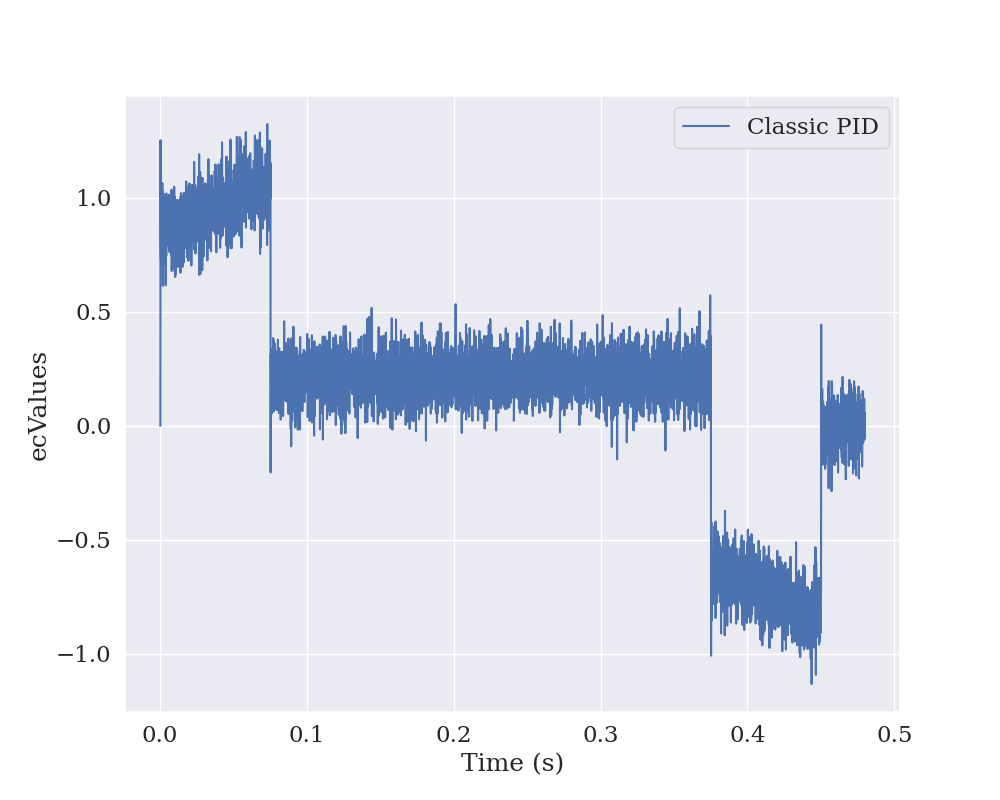
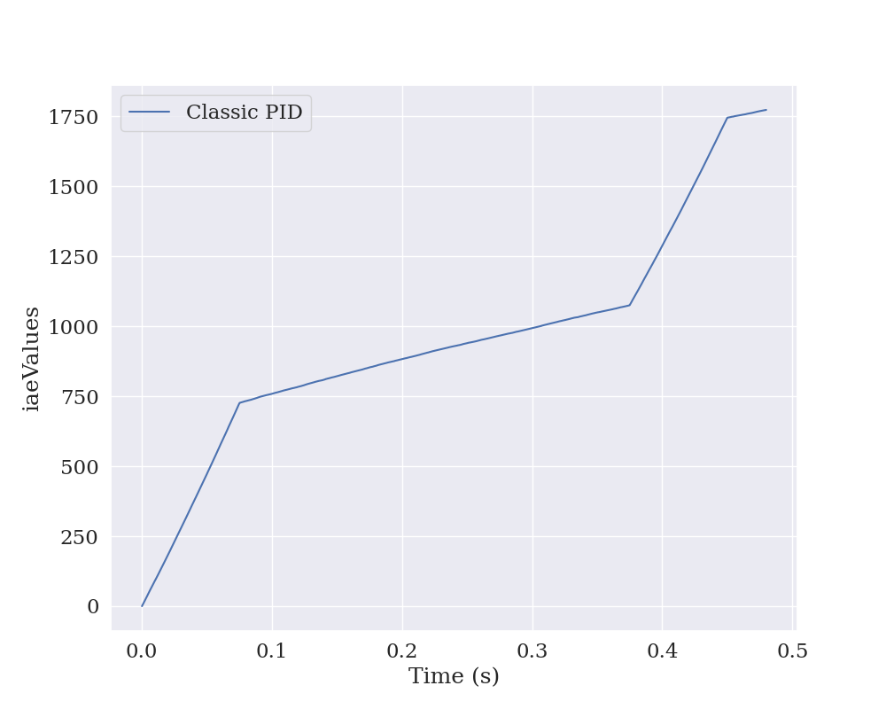
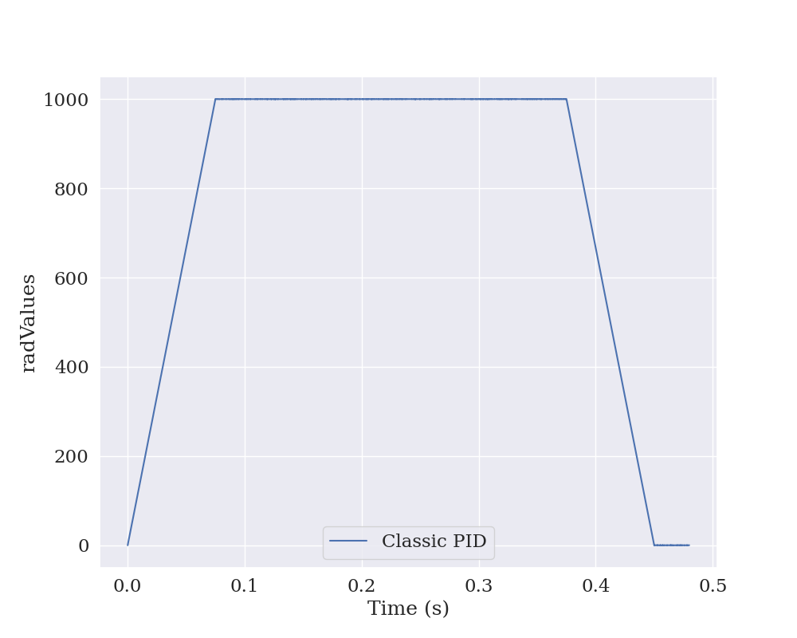
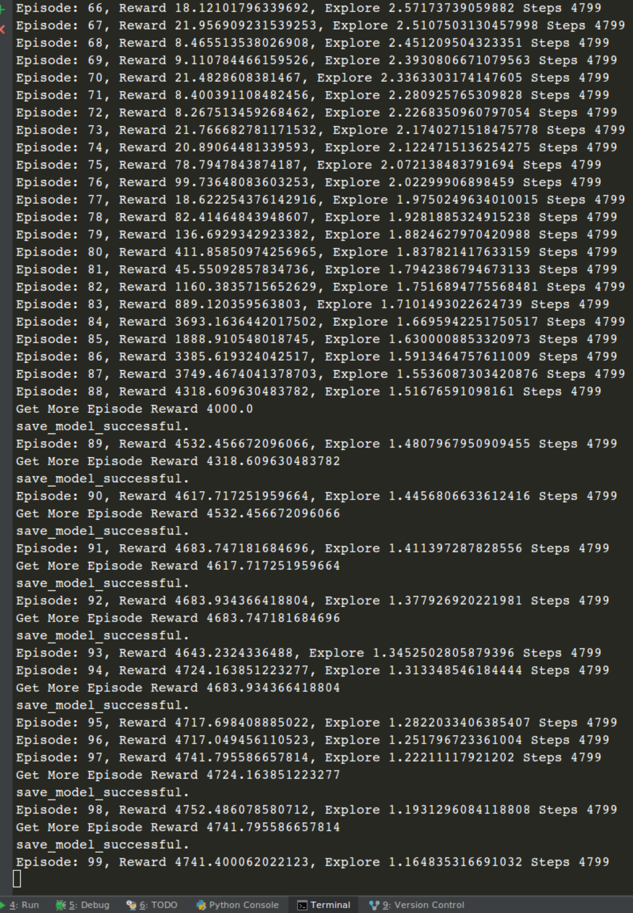
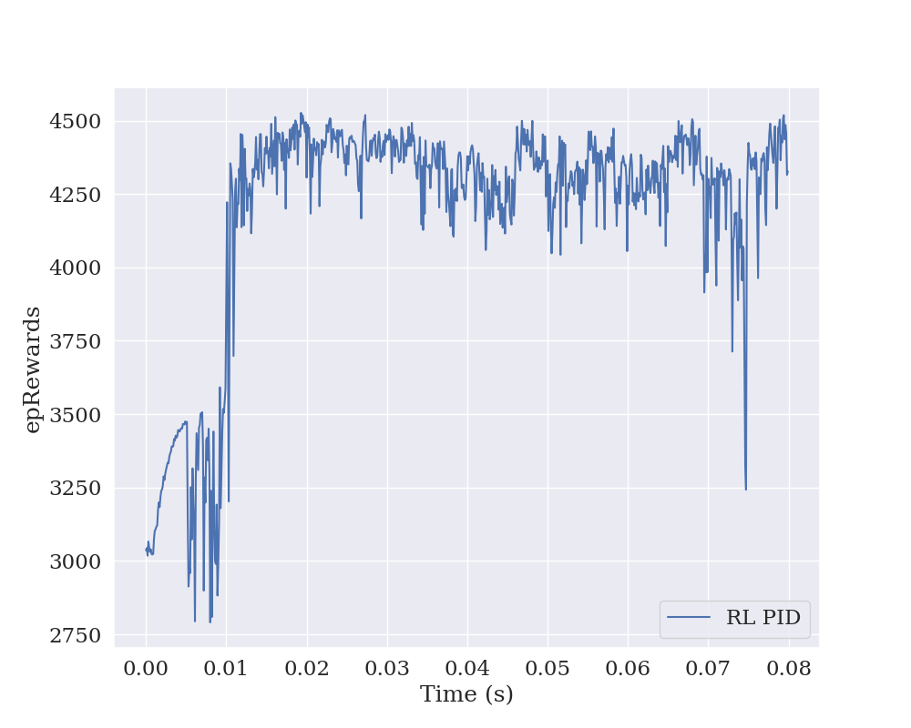

<div align="center">

# Control of Jump Systems Based on Reinforcement Learning

**Deep Reinforcement Learning for PID Auto-Tuning and Current Compensation in Speed Servo Systems**

[](https://www.mdpi.com/1999-4893/11/5/65)
[](https://www.python.org/)
[](https://www.tensorflow.org/)
[](LICENSE)
[](https://github.com/tinyzqh/control-of-jump-systems-based-on-reinforcement-learning/stargazers)

[English](#overview) · [简体中文](#中文简介)

</div>

---

## Overview

This repository is the **official implementation** of the paper
[*Control Strategy of Speed Servo Systems Based on Deep Reinforcement Learning*](https://www.mdpi.com/1999-4893/11/5/65) (Algorithms, 2018).

We replace hand-tuned PID controllers with **DDPG-based deep reinforcement learning agents** that:

- **Auto-tune** PID parameters online to track arbitrary reference trajectories.
- **Compensate** for nonlinear electric-current disturbances that classical PID cannot handle.
- **Adapt** to jump-system dynamics with sudden plant changes.

> If this work helps your research or engineering project, please consider giving the repo a **star** — it really keeps the project alive!

## Highlights

- **End-to-end RL-PID pipeline** — classical PID baseline, DDPG-based parameter search, and RL current compensation all in one repo.
- **Reproducible** — every figure in the paper can be regenerated with a one-line command.
- **Modular environment** — a Gym-style servo-system simulator (`servo_system_env.py`) you can plug into your own controllers.
- **Multiple reference curves** — trapezoidal, step, sinusoidal, trivially extendable.
- **Lightweight** — no GPU strictly required; trains in minutes on a laptop.

## Demo

**Classical PID baseline — trapezoidal reference tracking**

<div align="center">
    
    
    
</div>

**DDPG-based PID parameter search — training reward curve**

<div align="center">
    
</div>

**RL-PID current compensation — training reward curve**

<div align="center">
    
</div>

## Installation

Tested on Ubuntu 16.04 / 18.04.

```bash
git clone https://github.com/tinyzqh/control-of-jump-systems-based-on-reinforcement-learning.git
cd control-of-jump-systems-based-on-reinforcement-learning
pip install -r requirements.txt
```

Core dependencies:

| Package          | Version |
| ---------------- | ------- |
| tensorflow-gpu   | 1.14.0  |
| gym              | 0.17.3  |
| atari-py         | 0.2.6   |
| numpy            | 1.19.3  |

## Quick Start

### 1. Classical PID (no training required)

```bash
python run.py        --choose_model class_pid --curve_type trapezoidal --height 1000 --run_type test
python plot_result.py --choose_model class_pid --curve_type trapezoidal --height 1000 --run_type test
```

### 2. RL-tuned PID — let DDPG find the gains

```bash
python run.py --choose_model search_pid_parameter --curve_type trapezoidal --height 1000 --run_type train
```

### 3. RL current compensation

```bash
# train
python run.py --choose_model search_electric --curve_type trapezoidal --height 1000 --run_type train

# test
python run.py --choose_model search_electric --curve_type trapezoidal --height 1000 --run_type test

# plot
python plot_result.py --choose_model search_electric --curve_type trapezoidal --height 1000 --run_type train
```

## Repository Structure

```
.
├── run.py               # Unified entry point for train / test
├── plot_result.py       # Result visualization
├── parameter.py         # Hyperparameters & CLI arguments
├── servo_system_env.py  # Gym-style servo system simulator
├── PID.py               # Classical PID controller
├── utils.py             # Common helpers
├── results/             # Auto-generated logs and figures
└── requirements.txt
```

## Citation

If this project is useful for your research, please cite:

```bibtex
@article{chen2018control,
  title     = {Control Strategy of Speed Servo Systems Based on Deep Reinforcement Learning},
  author    = {Chen, Pengzhan and He, Zhiqiang and Chen, Chuanxi and Xu, Hongwei},
  journal   = {Algorithms},
  volume    = {11},
  number    = {5},
  pages     = {65},
  year      = {2018},
  publisher = {MDPI}
}
```

## Contributing

Issues, discussions, and pull requests are warmly welcomed. Feel free to open an issue if you encounter problems running the code or want to discuss extensions to other control problems.

## Show Your Support

If this repository helped you, please consider:

- Giving it a **star** on GitHub — it costs you one click and motivates further work.
- Citing the paper above in your publication.
- Sharing the project with colleagues interested in RL for industrial control.

---

## 中文简介

本仓库为论文 [*Control Strategy of Speed Servo Systems Based on Deep Reinforcement Learning*](https://www.mdpi.com/1999-4893/11/5/65) (Algorithms, 2018) 的**官方实现**。我们使用 **DDPG 深度强化学习算法**:

- 在线**自动整定**速度伺服系统的 PID 参数;
- 实时**补偿**经典 PID 难以处理的非线性电流扰动;
- 适应**跳变系统(Jump System)** 的突变动力学。

### 一行命令跑通三种模式

```bash
# 经典 PID 基线
python run.py --choose_model class_pid             --curve_type trapezoidal --height 1000 --run_type test

# DDPG 自动整定 PID
python run.py --choose_model search_pid_parameter  --curve_type trapezoidal --height 1000 --run_type train

# 强化学习电流补偿
python run.py --choose_model search_electric       --curve_type trapezoidal --height 1000 --run_type train
```

如果这份代码帮到了你的研究或工程项目,欢迎点一个 **Star**,这对作者非常重要!也欢迎在 Issue 区讨论控制问题与扩展思路。
